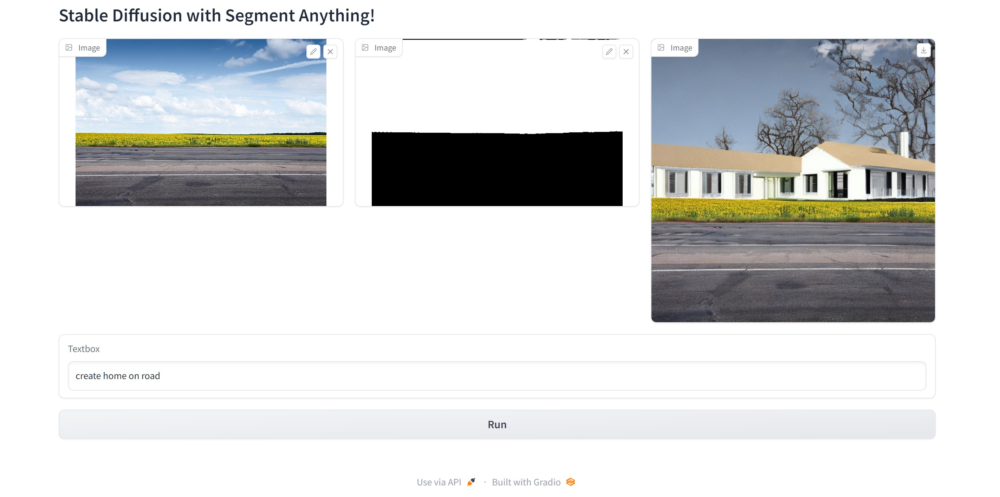

<div align="center">
<h1>
    Oracle Bridge for SAM and Stable Diffusion
</h1>

<h4>
The project  combines the "Segment Anything Model" (SAM) for interactive pixel selection and the "Stable Diffusion" model for inpainting based on user prompts, enabling users to create realistic image edits with a single click.
</h4>

## <div align="center">Overview</div>
The project is an innovative web application that harnesses the power of cutting-edge AI models to provide users with an extraordinary image editing experience. By seamlessly integrating the "Segment Anything Model" (SAM) and the "Stable Diffusion" model, this application enables users to effortlessly create stunning image edits with unprecedented ease and flexibility.

At the heart of this web app lies SAM, a state-of-the-art AI model capable of intelligently "cutting out" any object in an image with just a single click. Users can simply select pixels of interest, and SAM takes care of the rest, eliminating the need for tedious manual segmentation tasks. Moreover, SAM showcases its exceptional zero-shot generalization ability, allowing it to adapt to unfamiliar objects and images without requiring additional training.

Complementing SAM's pixel selection prowess, the Stable Diffusion model is employed for inpainting, granting users the power to generate photo-realistic images based on text input. By offering an interface that seamlessly combines user prompts and images, users can now effortlessly create incredible art with just a few clicks.

Whether one wishes to create artistic masterpieces, perform image restorations, or explore image manipulation, this web application opens up a world of possibilities, transforming the way people interact with images and AI technologies. With its user-friendly design and cutting-edge algorithms, the project empowers billions of individuals to unleash their creativity, bringing artistry and imagination to life within seconds.

## How to run?
```
git clone https://github.com/angadbawa/Oracle.git
cd stable-diffusion-with-sam-main/
pip install -r requirements.txt
python app.py
```

- To get the mask, we need to click on some part of the image for which you want to mask. If you didn't get the mask as expected, click at different locations, because Segment Anything Model works conditioned on the points of interests.

## <div align="center">Output</div>


