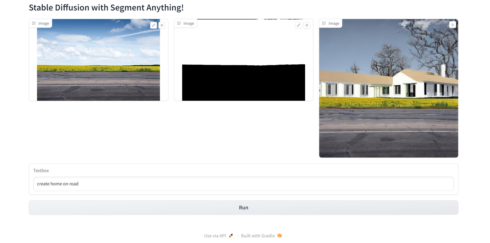

<div align="center">
<h1>
    Oracle Bridge for SAM and Stable Diffusion
</h1>

<h4>
The project  combines the "Segment Anything Model" (SAM) for interactive pixel selection and the "Stable Diffusion" model for inpainting based on user prompts, enabling users to create realistic image edits with a single click.
</h4>

## <div align="center">Overview</div>
The project is an innovative web application that harnesses the power of cutting-edge AI models to provide users with an extraordinary image editing experience. By seamlessly integrating the "Segment Anything Model" (SAM) and the "Stable Diffusion" model, this application enables users to effortlessly create stunning image edits with unprecedented ease and flexibility.

At the heart of this web app lies SAM, a state-of-the-art AI model capable of intelligently "cutting out" any object in an image with just a single click. Users can simply select pixels of interest, and SAM takes care of the rest, eliminating the need for tedious manual segmentation tasks. Moreover, SAM showcases its exceptional zero-shot generalization ability, allowing it to adapt to unfamiliar objects and images without requiring additional training.

Complementing SAM's pixel selection prowess, the Stable Diffusion model is employed for inpainting, granting users the power to generate photo-realistic images based on text input. By offering an interface that seamlessly combines user prompts and images, users can now effortlessly create incredible art with just a few clicks.

Whether one wishes to create artistic masterpieces, perform image restorations, or explore image manipulation, this web application opens up a world of possibilities, transforming the way people interact with images and AI technologies. With its user-friendly design and cutting-edge algorithms, the project empowers billions of individuals to unleash their creativity, bringing artistry and imagination to life within seconds.


### **Modular Structure**
```
Oracle/
├── src/
│   ├── core/                     # Core AI modules
│   │   ├── sam_predictor.py      # SAM model wrapper
│   │   ├── diffusion_pipeline.py # Stable Diffusion wrapper
│   │   └── image_processor.py    # Main orchestrator
│   ├── ui/                       # User interfaces
│   │   ├── gradio_app.py         # Web interface
│   │   └── cli_app.py            # Command line interface
│   └── utils/                    # Utilities
│       ├── config.py             # Configuration management
│       ├── logger.py             # Logging setup
│       └── helpers.py            # Helper functions
├── config/
│   └── default.yaml              # Configuration file
├── main.py                       # Unified entry point
└── requirements.txt              # Dependencies
```

### **Key Components**

- **`SAMPredictor`**: Segment Anything Model wrapper for interactive segmentation
- **`DiffusionInpainter`**: Stable Diffusion pipeline for text-guided inpainting
- **`ImageProcessor`**: Main orchestrator combining SAM + Diffusion
- **`OracleGradioApp`**: Web interface with interactive UI
- **`OracleCLI`**: Command-line interface for automation

## ⚙️ Configuration

Oracle uses YAML configuration files for easy customization:

```yaml
# config/default.yaml
models:
  sam:
    model_type: "vit_h"
    checkpoint_path: "./weights/sam_vit_h_4b8939.pth"
    device: "cpu"  # or "cuda"
  
  stable_diffusion:
    model_name: "stabilityai/stable-diffusion-2-inpainting"
    device: "cpu"  # or "cuda"

image:
  default_size: [512, 512]
  max_file_size_mb: 10

processing:
  diffusion:
    num_inference_steps: 20
    guidance_scale: 7.5
    strength: 0.8
```

### **Custom Configuration**

```bash
# Use custom config file
python main.py web --config my_config.yaml

# Override device settings
python main.py web --device cuda
```

## 🖥️ Web Interface

The Gradio web interface provides an intuitive way to use Oracle:

1. **Upload Image**: Load your image
2. **Click to Segment**: Click on areas to segment with SAM
3. **Enter Prompt**: Describe what you want to generate
4. **Generate**: Create AI-powered inpainting results

### **Features**
- Interactive point selection
- Real-time mask generation
- Advanced parameter controls
- System information display
- Example prompts

## CLI Interface

Powerful command-line tools for automation and batch processing:

### **Inpaint from Click**
```bash
python main.py cli inpaint-click \
  image.jpg 150 200 \
  "a beautiful sunset" \
  --negative "blurry, low quality" \
  --steps 30 \
  --guidance 8.0 \
  --output-dir ./results
```

### **Inpaint with Mask**
```bash
python main.py cli inpaint-mask \
  image.jpg mask.jpg \
  "a field of flowers" \
  --output-dir ./results
```

### **Generate Mask Only**
```bash
python main.py cli mask-only \
  image.jpg "100,150,200,250,300,350" \
  --output-dir ./masks
```

## Advanced Usage

### **Python API**

```python
from src import ImageProcessor, get_config

# Initialize processor
processor = ImageProcessor()

# Process image with click coordinates
results = processor.process_click_to_inpaint(
    image="image.jpg",
    x=150, y=200,
    prompt="a beautiful garden",
    save_output=True
)

# Access results
original = results['original_image']
mask = results['mask'] 
inpainted = results['inpainted_image']
```

### **Custom Configuration**

```python
from src.utils.config import get_config

# Load custom config
config = get_config("custom_config.yaml")

# Override settings
config.set('models.sam.device', 'cuda')
config.set('processing.diffusion.num_inference_steps', 30)
```

## 📊 System Requirements

### **Minimum Requirements**
- Python 3.8+
- 8GB RAM
- 2GB disk space

### **Recommended**
- Python 3.9+
- 16GB+ RAM
- NVIDIA GPU with 8GB+ VRAM
- CUDA 11.8+

### **GPU Acceleration**

For faster inference, install CUDA-enabled PyTorch:

```bash
# CUDA 11.8
pip install torch torchvision --index-url https://download.pytorch.org/whl/cu118

# Update config to use GPU
python main.py web --device cuda
```

## <div align="center">Output</div>



